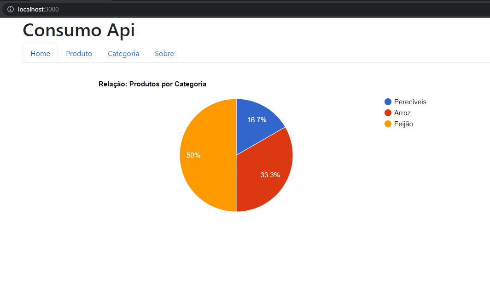
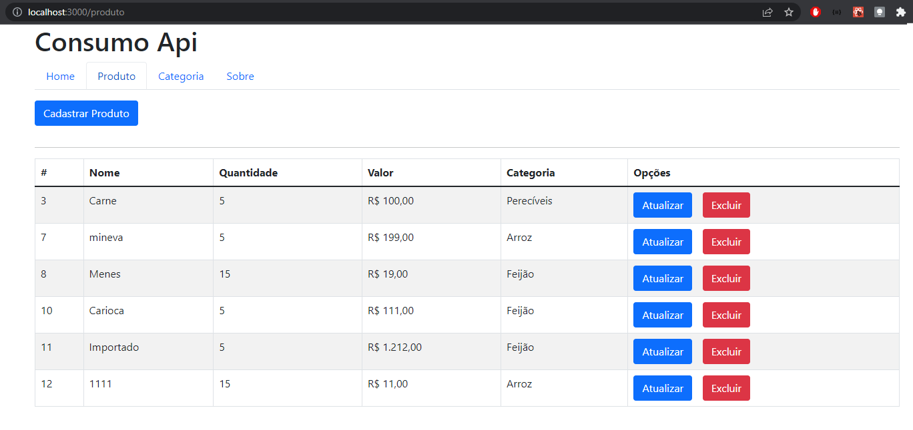
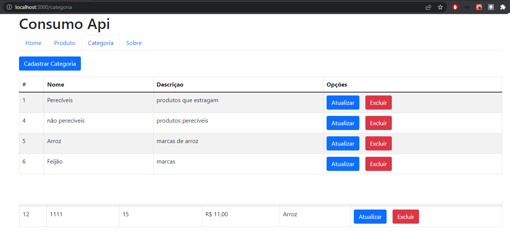

# 
API com Spring Boot 

  

Objetivo do projeto:

-   Desenvolver o Front End em REACT para consumir e manipular os dados vindo de uma API
-   Projeto em REACT
-   Consumo das API com fetch, sem usar promise.
-

<figure align="center">
  
  <figcaption>Tela inicial</figcaption>
</figure>

<figure align="center">
  
  <figcaption>Tela produto</figcaption>
</figure>

<figure align="center">
  
  <figcaption>Tela categoria</figcaption>
</figure>

## Back End:

https://github.com/FerndsLuis/backend_produtosCategoria_crud

## Features

-   [x] Modal cadastro de Categoria/Produtos
-   [x] Modal atualização de Categoria/Produtos
-   [x] Modal edição de Categoria/Produtos
-   [x] Modal exclusão de Categoria/Produtos

## Ferramentas utilizadas

-   React
-   Bootstrap
-   React Google Charts

## Como clonar?

    git clone https://github.com/FerndsLuis/frontend_produtosCategoria_crud.git
    npm i
    npm run start
